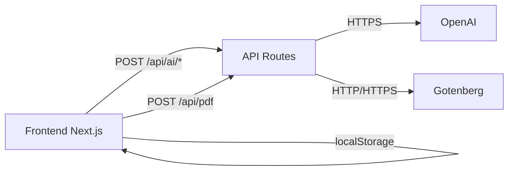

# Architecture — job-research-assistant

## 1. Vue d’ensemble

- Frontend Next.js (UI + state local)
- API Routes Next.js (proxy IA + PDF)
- Services externes (OpenAI, Gotenberg)

## 2. Agrégats métier

- `CV`
  - versions CV, version active, feedback IA par section.
- `Application`
  - métadonnées candidature, statut, offre courante (non versionnée).
- `CoverLetter`
  - lettre + référence candidature + version CV.
- `Settings`
  - clé OpenAI utilisateur et préférences.

## 3. Flux principaux

## 3.1 Feedback section CV

1. UI envoie section + données + clé API.
2. API valide et appelle OpenAI.
3. UI stocke feedback localement.

## 3.2 Optimisation CV pour offre

1. UI envoie CV actif + offre candidature + clé API.
2. API appelle OpenAI pour analyse d’alignement.
3. UI reçoit recommandations structurées (score + actions).
4. L’utilisateur applique puis sauvegarde en nouvelle version CV.

## 3.3 Lettre de motivation

1. UI envoie `applicationId`, `cvVersionId`, offre courante, tonalité/langue.
2. API appelle OpenAI.
3. UI sauvegarde la lettre liée à la candidature et à la version CV.

## 3.4 Export PDF

1. UI rend le CV actif en HTML.
2. API `/api/pdf` proxifie vers Gotenberg.
3. PDF renvoyé au navigateur.

## 4. Principes de conception

- local-first, backend stateless,
- versioning limité au CV en MVP,
- validation stricte des payloads,
- API key fournie par l’utilisateur, jamais persistée serveur.

## 5. Hors périmètre MVP

- versioning d’offre,
- base de données,
- authentification,
- synchronisation cloud.
